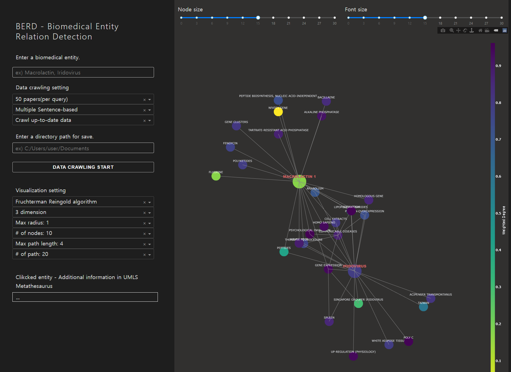

Biomedical Entity Relation Detection
=====================================

**Author:** *[Wooheon Hong](https://www.linkedin.com/in/wooheon-hong-b33621200/)*, *[Jaehyun Lee](https://www.linkedin.com/in/jaehyun-lee-56613a1ba/)* 

**Date:** 2020.12.20 ~ 2021. 03. 29

This is biomedical entity relation network.

Identify the connection relationship between entitiy in the papers in [PubMed](https://pubmed.ncbi.nlm.nih.gov/). 

Find the relationship between entities based on one sentence, consecutive sentences(in this setting, [**Swanson ABC model**](https://www.sciencedirect.com/science/article/pii/S1532046412001517) can be used) or entire paper.



It also supports relation network for three or more queries.

# Requirements 
- python3 
- see `requirements.txt`

```
conda create –n name python=3.7
conda activate name
pip install --upgrade pip
pip install -r requirements.txt
```

# Datasets

We used [PubMed](https://pubmed.ncbi.nlm.nih.gov/) thesis data by crwaling 

# Run

## Commands 

```
python app.py
```

## Arguments

`test_model.py` provides more arguments than `app.py` provides.

```
python test_model.py 
```

- load_or_not
    - Select whether run model or use previously saved data
- query 
    - ex) macrolactin, iridovirus
- n_papers 
    - The number of pepers 
- n_sentence(In the app.py, relation unit)
    - 0: document
    - 1: network consists of one sentence 
    - 2: network consists of two consecutive sentence. The Swanson ABC model is available.

    The amount of entity pairs is large in order 0 > 2 > 1.

- is_swanson
    - Using Swanson ABC model
    - n_sentence must be 2

- type_scispacy
    - Select Biomedical Entity Linking model 
    - [Scispacy](https://allenai.github.io/scispacy/)

- layout_algo
    - Node Coordinate Algorithm
- laout_dim 
    - Select Plot Dimension 2, 3
- radius
    - Select hop except path 
- n_nodes
    - The number of nodes 
- cutoff
    - Select max path(link between query) length
- n_path 
    - The number of paths 


# Security 

The `data.sqlite` file is the database and stores the username, password, and email address in the Users table.

To protect user passwords, the password is hashed. 
    
